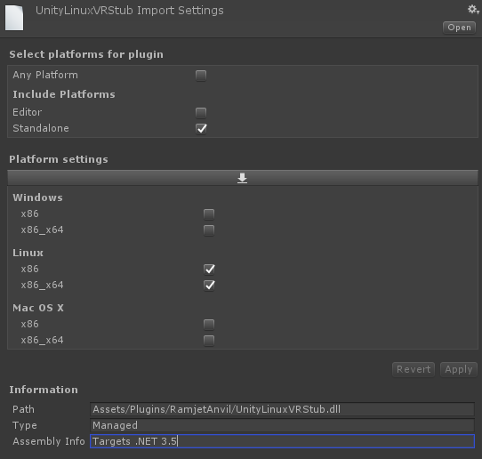

# Unity VR Linux Stub

Stub implementation dll to compile a VR Unity game for Linux.

This plugin is useful if you have a game that has optional VR support.
On Linux this plugin will simply report that no VR device is available.

# Installation

- Compile or download the UnityVrLinuxStub dll and put it in the `Assets/Plugins` folder.
- Change the import settings of the dll in the Unity editor to the following: 
